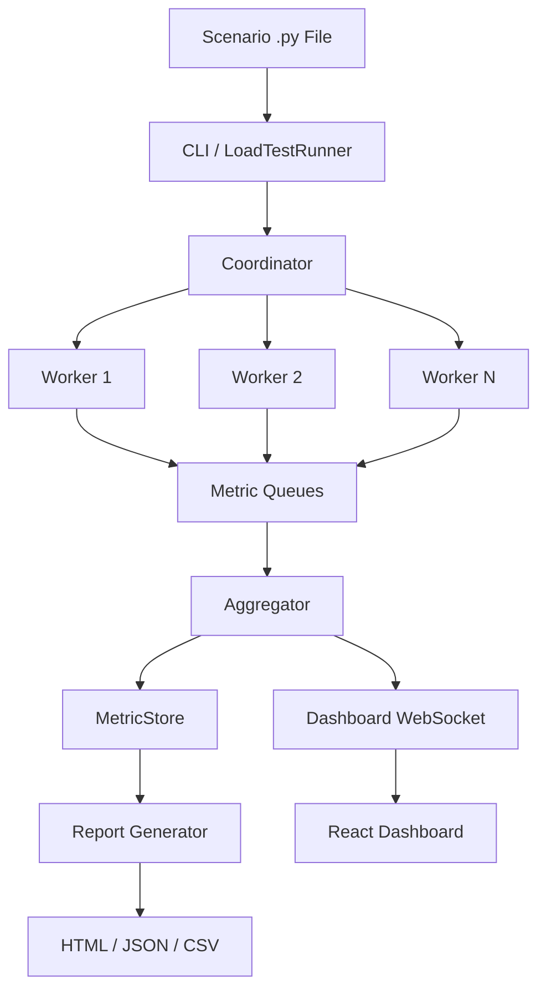

# LoadForge

[](https://github.com/aqasim81/api-load-testing-framework/actions/workflows/ci.yml)
[](https://python.org)
[](LICENSE)
[](https://mypy-lang.org/)

Forge realistic load tests as Python code.

LoadForge is a Python load testing framework for crafting realistic API
load tests with code-first scenarios, seven traffic patterns, multi-core
execution, interactive HTML reports, and a live React dashboard.

## Features

- **Code-first scenarios** — define load tests as Python classes with
  `@scenario` and `@task` decorators
- **7 traffic patterns** — constant, ramp, step, spike, diurnal,
  composite, plus custom patterns via `LoadPattern` ABC
- **Multi-core engine** — distributes virtual users across CPU cores
  via multiprocessing with shared metric queues
- **Live dashboard** — real-time React + Recharts WebSocket dashboard
- **Interactive reports** — self-contained HTML with Plotly charts,
  plus JSON and CSV exports
- **HDR histograms** — percentile-accurate latency tracking
  (p50 / p95 / p99 / p99.9)
- **Fully typed** — PEP 561 typed, zero `Any`, strict mypy

## Quick Start

### Installation

```bash
pip install loadforge
```

### 1. Create a scenario

```bash
loadforge init my_api_test
```

Or write one directly:

```python
from loadforge import HttpClient, scenario, task

@scenario(name="My API", base_url="http://localhost:8080")
class MyScenario:
    @task(weight=1)
    async def get_root(self, client: HttpClient) -> None:
        await client.get("/", name="Root")
```

### 2. Run it

```bash
loadforge run my_api_test.py --users 50 --duration 60
```

### 3. View results

An HTML report is generated in `./results/report.html`. For live
monitoring, add `--dashboard`:

```bash
loadforge run my_api_test.py --users 50 --duration 60 --dashboard
```

Then open `http://localhost:8089` in your browser.

## Traffic Patterns

| Pattern | CLI Flag | Description |
|---------|----------|-------------|
| Constant | `--pattern constant` | Fixed user count (default) |
| Ramp | `--pattern ramp --ramp-to N` | Linear ramp up/down |
| Step | `--pattern step --step-size N` | Staircase increments |
| Spike | `--pattern spike` | Sudden burst + decay |
| Diurnal | `--pattern diurnal` | Sine-wave day/night cycle |
| Composite | *(programmatic)* | Chain patterns sequentially |

## Architecture



**How it works:**

1. The CLI loads a scenario file and builds a traffic pattern
2. The **Coordinator** spawns worker processes (one per CPU core)
3. Each **Worker** runs an async event loop driving virtual users
4. Virtual users execute weighted `@task` methods against the target API
5. Request metrics flow through **queues** to the **Aggregator**
6. The aggregator feeds the **live dashboard** (WebSocket) and
   **MetricStore** (time-series)
7. After the test, the **Report Generator** produces HTML/JSON/CSV

## CLI Reference

```
loadforge run <scenario.py> [OPTIONS]

Options:
  -u, --users INT              Target concurrent users (default: 10)
  -d, --duration FLOAT         Test duration in seconds (default: 60)
  -p, --pattern TEXT           Traffic pattern (default: constant)
      --ramp-to INT            Ramp pattern: target user count
      --step-size INT          Step pattern: users added per step
      --step-duration FLOAT    Step pattern: seconds between steps
  -w, --workers INT            Worker processes (default: CPU count)
  -o, --output PATH            Output directory (default: ./results)
  -f, --format TEXT            Report format: html, json, csv (default: html)
      --no-report              Skip report generation
      --dashboard              Start live dashboard server
      --dashboard-port INT     Dashboard port (default: 8089)
      --fail-on-error-rate F   Exit non-zero if error rate exceeds threshold
  -v, --verbose                Enable debug logging

loadforge init [name]          Scaffold a new scenario file
loadforge report <dir>         Regenerate reports from saved data
loadforge dashboard <dir>      Replay results in the live dashboard
loadforge --version            Show version
```

## Examples

| Example | File | Demonstrates |
|---------|------|--------------|
| Basic GET | [`basic_get.py`](examples/basic_get.py) | Minimal single-endpoint scenario |
| REST API | [`rest_api.py`](examples/rest_api.py) | Multi-endpoint with weighted tasks |
| Auth flow | [`auth_flow.py`](examples/auth_flow.py) | Setup / teardown hooks |
| Spike test | [`spike_test.py`](examples/spike_test.py) | Spike traffic pattern |
| Diurnal | [`diurnal_simulation.py`](examples/diurnal_simulation.py) | Day/night traffic cycle |
| Composite | [`composite_pattern.py`](examples/composite_pattern.py) | Multi-phase load profile |

## Comparison

| Feature | LoadForge | Locust | k6 | JMeter |
|---------|-----------|--------|----|--------|
| Language | Python | Python | JavaScript | XML / GUI |
| Async I/O | aiohttp | gevent | Go runtime | Threads |
| Multi-core | multiprocessing | distributed | goroutines | threads |
| Traffic patterns | 7 built-in | manual shape | manual | plugins |
| Live dashboard | React + WS | built-in | Grafana | built-in |
| HTML reports | Plotly | built-in | — | built-in |
| HDR histograms | yes | no | yes | partial |
| Typed (mypy strict) | yes | no | N/A | N/A |
| Custom patterns | `LoadPattern` ABC | shape class | — | — |

## Development

```bash
git clone https://github.com/aqasim81/api-load-testing-framework.git
cd api-load-testing-framework
uv sync --all-extras
make validate          # Format, lint, type-check, test (80%+ coverage)
```

### Running tests

```bash
uv run pytest tests/unit/ -v           # Unit tests
uv run pytest tests/integration/ -v    # Integration tests
uv run pytest tests/e2e/ -v            # End-to-end CLI tests
```

## License

[MIT](LICENSE)
